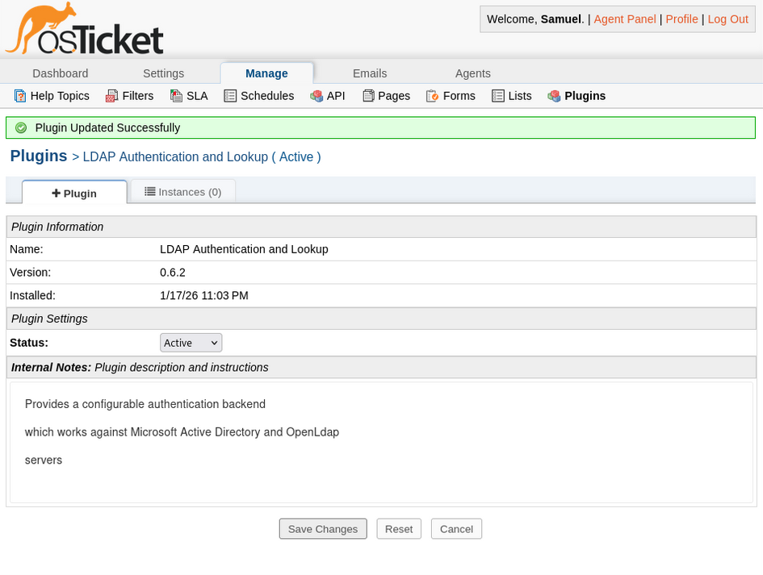

# Architecture — osTicket Helpdesk Enterprise Lab

## Purpose

This document describes the architecture of the osTicket Helpdesk Lab, including system components, network topology, trust boundaries, and data flows. The goal of this environment is to simulate a realistic internal IT service desk commonly found in small-to-mid-size enterprises, emphasizing centralized identity, secure authentication, role separation, and operational realism.

This lab is intentionally designed as an **enterprise-style internal platform**, not a public-facing SaaS deployment.

## Enterprise Context

In many organizations, the IT helpdesk operates as an internal service tightly integrated with Active Directory, internal PKI, and segmented infrastructure networks. This architecture reflects that reality by prioritizing:

- Centralized identity and authentication
- Secure, encrypted directory communication
- Clear separation between users, agents, and administrators
- Controlled network exposure and minimized attack surface
- Operational simplicity over horizontal scalability

High availability and external access are intentionally out of scope in favor of architectural clarity and security fundamentals.

## High-Level Architecture Overview

The environment consists of a **single Linux application server** running osTicket and its supporting services, integrated with a **Windows Server Active Directory Domain Controller**. Active Directory acts as the authoritative identity source, while osTicket functions as a consuming application for authentication, authorization, and workflow management.

All systems operate within an isolated internal network to simulate a protected enterprise infrastructure.

## System Components

### Application Server — `osticket01` (Debian GNU/Linux 12)

- osTicket v1.18.x
- Apache 2 web server
- PHP 8.2 runtime
- MariaDB database backend
- Zabbix Agent (for infrastructure monitoring)

This server hosts both the application and database layers. While production environments may separate these roles, a single-server deployment is common in departmental or SMB environments and reduces operational complexity without sacrificing architectural integrity.

### Directory Services — `dc01` (Windows Server)

- Active Directory Domain Services for `lab.local`
- DNS for internal name resolution
- Active Directory Certificate Services (internal Microsoft CA)
- LDAPS-enabled directory authentication

The Domain Controller serves as the authoritative source for user and agent identities and issues certificates used to secure LDAP communication.

## Network Architecture

### Network Segmentation and Intent

All virtual machines reside on a **VirtualBox Host-Only network**, creating an isolated internal subnet that simulates an enterprise infrastructure VLAN. This design enforces the following principles:

- Internal services are not directly exposed to the host or external networks
- Authentication traffic remains within a trusted boundary
- Lateral movement is limited to explicitly permitted systems

Optional NAT connectivity may be used for operating system updates, but it is not required for normal authentication or application workflows.

## Hostnames and Identity

- **Active Directory Domain:** `lab.local`
- **Domain Controller:** `dc01.lab.local`
- **osTicket Server:** `osticket01.lab.local`
- **Service Account:** `svc_osticket@lab.local`
- **LDAPS Endpoint:** `ldaps://dc01.lab.local:636`

Consistent DNS naming is used to mirror real enterprise environments and ensure certificate validation functions correctly during LDAPS authentication.

## Ports and Protocols

### osTicket Server (`osticket01`)

- TCP 80 — HTTP (lab access and testing)
- TCP 443 — HTTPS (recommended for production-style environments; noted as a future enhancement)
- TCP 3306 — MariaDB (restricted to local access)

### Domain Controller (`dc01`)

- TCP 636 — LDAPS (secure directory authentication)
- TCP/UDP 53 — DNS (internal name resolution)

Only required ports are exposed, and directory communication is encrypted by design.

## Trust and Certificate Model (LDAPS)

Authentication between osTicket and Active Directory is secured using **LDAP over SSL (LDAPS)**. The trust model mirrors enterprise environments that rely on internal Public Key Infrastructure (PKI).

Key characteristics:

- The Domain Controller presents an LDAPS certificate issued by the internal Microsoft CA
- The Debian server explicitly trusts the internal CA certificate
- osTicket performs encrypted directory binds and queries over port 636
- Credentials and directory data are protected from interception

This approach avoids plaintext LDAP and demonstrates proper certificate-based trust validation between Linux and Windows systems.

## Authentication and Data Flows

### User Ticket Submission

1. User accesses the osTicket client portal
2. User authenticates using Active Directory credentials
3. osTicket validates credentials against AD over LDAPS
4. Ticket data is written to MariaDB

**Authoritative Identity:** Active Directory  
**Credential Storage:** Active Directory only  
**Application Role:** Identity consumer

### Agent Ticket Handling

1. Agent logs into the osTicket agent interface
2. Authentication is performed via AD (LDAPS)
3. Role-based access controls determine permitted actions
4. Ticket updates and internal notes are stored in MariaDB

RBAC ensures separation between Tier 1, Tier 2, NOC, and administrative functions.

### Directory Lookup and Authorization

1. osTicket binds to Active Directory using a dedicated read-only service account
2. Directory searches retrieve user attributes and group membership
3. Authorization decisions are enforced within osTicket based on mapped roles and departments

The service account is intentionally limited to directory read access to reduce risk.

## Security Boundaries and Assumptions

- End users interact only with the web application
- Agents have application-level access governed by RBAC
- Server-level access is restricted to administrators
- Directory authentication traffic is encrypted using LDAPS
- The database is not exposed to the network

These boundaries reflect common enterprise security controls and least-privilege principles.

## Design Decisions and Tradeoffs

- **Single-server deployment:** Chosen to reflect common departmental and SMB environments while maintaining architectural clarity
- **LDAPS over StartTLS:** Simplifies configuration and enforces encryption by default
- **Internal PKI trust:** Demonstrates enterprise certificate management and secure service communication
- **Read-only service account:** Limits blast radius in the event of credential compromise
- **Isolated internal networking:** Prevents unnecessary exposure of authentication services
- **Deferred HTTPS configuration:** Noted as a production enhancement rather than a requirement for internal lab validation

Each decision balances realism, security, and maintainability rather than scale for its own sake.

## Summary

This architecture demonstrates a realistic internal IT helpdesk platform integrated with centralized identity, secure authentication, and controlled network access. The design mirrors real enterprise deployments where operational clarity, security boundaries, and identity-driven workflows are prioritized over external exposure or unnecessary complexity.
