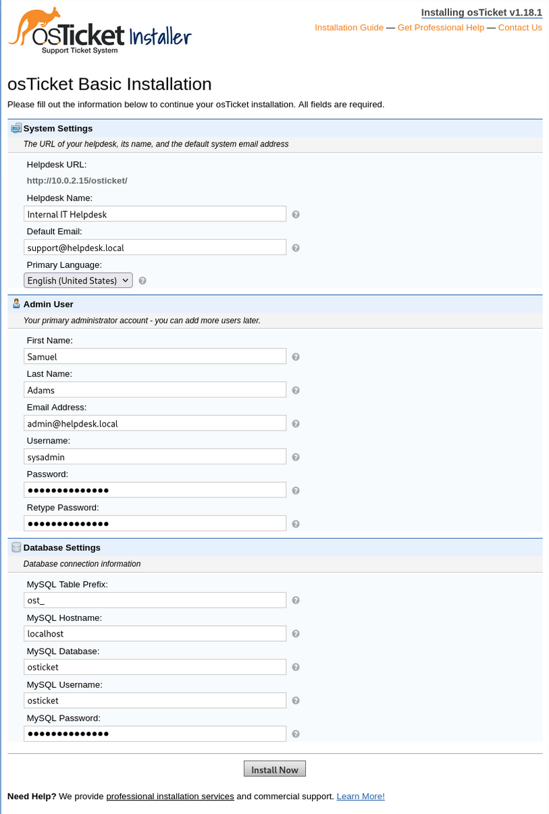
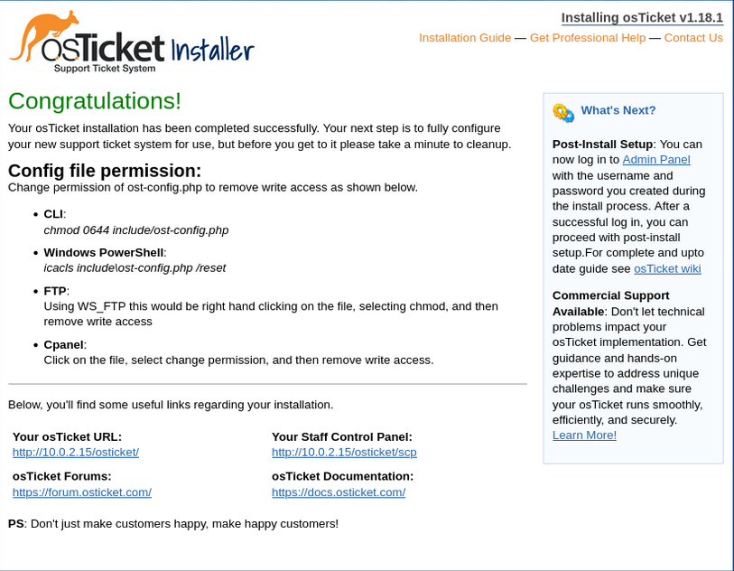

# Deployment & Baseline Configuration — osTicket Helpdesk Lab

## Purpose

This document describes the initial deployment and baseline configuration of the osTicket helpdesk platform on Debian GNU/Linux 12. This phase establishes a stable, secure, and validated application baseline suitable for internal enterprise use.

Identity integration and external dependencies are intentionally excluded at this stage to isolate application deployment from authentication and infrastructure concerns. Those integrations are addressed in subsequent phases.

## Deployment Scope and Constraints

This deployment reflects a common **internal IT service desk** scenario, where the helpdesk platform operates within a trusted network and relies on centralized identity services rather than managing credentials locally.

Key constraints:
- Single-server deployment
- Internal-only access
- No public exposure
- Security-first baseline configuration

The objective is operational clarity and stability rather than scale or high availability.

## Platform Selection

**Debian GNU/Linux 12 (Bookworm)** was selected based on:

- Long-term stability and predictable update cadence
- Native compatibility with PHP 8.2, required by osTicket
- Broad community and enterprise adoption
- Reliable availability of required PHP extensions (including IMAP)

Testing against newer distributions revealed dependency friction, reinforcing the importance of platform stability over novelty in production-style environments.

## Base System Preparation

The operating system was installed using a minimal server profile to reduce unnecessary services and attack surface.

Baseline decisions included:
- No graphical desktop environment
- SSH-enabled remote administration
- Immediate application of security and package updates
- Consistent hostname and DNS configuration

This approach aligns with standard enterprise server provisioning practices.

## Application Stack Deployment

The osTicket application stack was deployed using distribution-supported packages to ensure maintainability and security.

Components included:
- **Apache 2** as the HTTP service
- **PHP 8.2** as the application runtime
- Required PHP extensions for email processing, database access, and session handling
- **MariaDB** as the relational database backend

All services were configured to start automatically and verified for stability prior to application deployment.

## Database Configuration and Hardening

MariaDB was configured following vendor-recommended security practices.

Key decisions:
- Dedicated database created exclusively for osTicket
- Application-specific database user
- Least-privilege permissions
- Local-only database access

Database connectivity was validated prior to application installation to eliminate authentication or schema-related failures during runtime.

## Application Deployment

The osTicket application was deployed manually to maintain explicit control over file placement and permissions.

Deployment actions included:
- Downloading the official osTicket release
- Extracting files into the Apache web root
- Assigning ownership to the web service account
- Applying restrictive default file permissions

Configuration files were made writable **only for the duration of installation**, minimizing exposure.

## Initial Application Configuration

The osTicket web-based installer was used to complete initial application setup.

Configuration actions included:
- Defining helpdesk identity and system metadata
- Creating an initial administrative account
- Establishing database connectivity

Installer behavior was monitored via Apache error logs to detect and resolve runtime or permission issues.

## Post-Installation Hardening

Immediately following installation, the application was hardened to prevent unauthorized reconfiguration.

Hardening actions:
- Removal of the osTicket setup directory
- Restriction of configuration file permissions to read-only
- Validation of application behavior after service restarts

These steps ensure the application cannot be reinstalled or modified without explicit administrative intervention.

## Deployment Validation

The deployment was validated through functional and operational testing:

- Successful access to the user ticket submission portal
- Successful access to the agent and administrator interfaces
- Creation, processing, and resolution of test tickets
- Verification of service persistence across system restarts

Validation confirmed the platform was ready for integration with external enterprise services.

## Baseline Snapshot and Change Control

Upon successful validation, the system was snapshotted to preserve a known-good baseline state. This snapshot serves as a rollback point and reference for future configuration changes.

Subsequent enhancements build upon this baseline rather than modifying it retroactively.

## Phase Completion Summary

At the conclusion of this phase, the environment met the following criteria:

- Stable and functional osTicket deployment
- Hardened baseline configuration
- Verified application and database operation
- Controlled and documented deployment process

This phase establishes the foundation for identity integration, monitoring, and enterprise workflow configuration in later stages.
