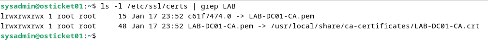
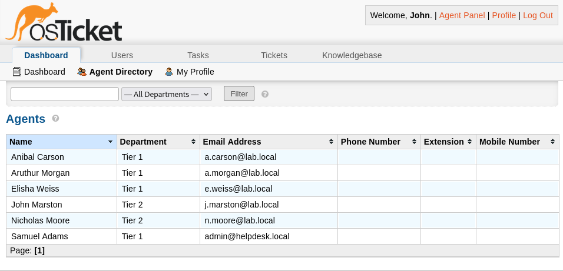

# Authentication & Directory Integration — Active Directory (LDAPS)

## Purpose

This document describes the integration of osTicket with Microsoft Active Directory using LDAP over SSL (LDAPS). The objective of this configuration is to centralize authentication, enforce enterprise identity boundaries, and eliminate local credential storage within the helpdesk platform.

Both end users and support agents authenticate using Active Directory credentials, while osTicket functions strictly as an identity consumer.

## Enterprise Authentication Model

Active Directory serves as the **authoritative identity provider** for this environment. osTicket does not manage passwords, perform credential validation locally, or act as an identity store.

Key principles:
- Identity authority resides exclusively in Active Directory
- Authentication traffic is encrypted end-to-end
- osTicket performs directory lookups and authorization mapping only
- Credentials are never stored or validated locally by the application

This mirrors standard enterprise authentication patterns used by internal business applications.

## Directory Environment

### Active Directory

- **Domain:** `lab.local`
- **Domain Controller:** `dc01.lab.local`
- **IP Address:** `192.168.56.103`
- **Directory Services:** AD DS, DNS
- **Certificate Authority:** Internal Microsoft CA

Active Directory provides authentication, directory lookups, and group membership data used to enforce access control within osTicket.

### osTicket Application Server

- **Hostname:** `osticket01.lab.local`
- **Operating System:** Debian GNU/Linux 12
- **Application:** osTicket v1.18.x

The osTicket server operates as a Linux-based application consumer within a Windows-centric identity environment, reflecting common enterprise heterogeneity.

## Why LDAPS Is Mandatory

Plain LDAP transmits credentials in a form that can be intercepted on the network. In enterprise environments, plaintext directory authentication is considered a critical security failure.

LDAPS provides:
- Encryption of credentials and directory queries
- Server identity verification using X.509 certificates
- Protection against credential harvesting and replay attacks
- Alignment with enterprise security baselines

This lab explicitly **does not permit plaintext LDAP** under any circumstances.

## Certificate Trust and PKI Model

### Internal Certificate Authority

The Domain Controller presents an LDAPS certificate issued by an internal Microsoft Certificate Authority. This certificate establishes server identity during authentication.

### Linux Trust Configuration

To validate the Domain Controller’s identity, the Debian server was configured to trust the internal CA:

- The CA certificate is installed into the system trust store
- Trust is applied system-wide, not application-specific
- LDAP clients rely on standard TLS validation mechanisms

This approach mirrors real-world enterprise environments where Linux systems must integrate securely with Windows PKI.

 

Successful TLS validation confirms:
- Certificate chain integrity
- Correct hostname matching
- Encrypted session establishment

## Service Account Design

### Service Account Details

- **Account:** `svc_osticket@lab.local`
- **Purpose:** LDAP bind and directory search operations
- **Permissions:** Read-only access

### Least-Privilege Enforcement

The service account:
- Cannot modify directory objects
- Is not a domain administrator
- Is restricted to authentication and lookup operations only

This design limits blast radius in the event of credential compromise and aligns with least-privilege principles.

## osTicket LDAP Configuration

### Connection Parameters

- **LDAP URI:** `ldaps://dc01.lab.local:636`
- **Bind Identity:** `svc_osticket@lab.local`
- **Base DN:** `DC=lab,DC=local`

The connection is encrypted by default and validated using the system trust store.

### Authentication Behavior

- End users authenticate using Active Directory credentials
- User records are created dynamically upon first successful login
- Support agents authenticate via AD and are assigned application roles manually
- Passwords are never stored within osTicket

Directory attributes commonly consumed include:
- `sAMAccountName`
- `mail`
- `displayName`
- `memberOf`

## Authentication Flows

### End User Authentication

1. User submits credentials to the osTicket portal
2. osTicket binds to Active Directory over LDAPS
3. Active Directory validates credentials
4. User session is established without local password storage

**Authority:** Active Directory  
**Consumer:** osTicket

### Agent Authentication

1. Agent authenticates via AD over LDAPS
2. osTicket maps the authenticated identity to an agent profile
3. Role-Based Access Control determines permitted actions
4. Access is enforced at the application level

Authentication and authorization are explicitly separated.

## Security Controls and Logging

- All directory communication is encrypted
- Certificate validation prevents rogue directory impersonation
- Authentication failures are logged for operational visibility
- Service account credentials are protected at rest

These controls provide defense-in-depth for identity operations.

## Validation and Evidence

LDAPS integration was validated through multiple mechanisms:

- Successful TLS handshake and certificate validation from Debian
- Verified trust of the internal CA
- Successful user and agent authentication using AD credentials
- Confirmed role enforcement within osTicket

 

This validation confirms both **functional authentication** and **secure transport enforcement**.

## Common Failure Scenarios

| Symptom | Likely Cause |
|-------|-------------|
| LDAPS connection fails | Internal CA not trusted |
| Certificate validation error | Hostname mismatch or expired certificate |
| Authentication timeout | Firewall or network filtering |
| Login succeeds intermittently | DNS resolution inconsistency |
| Bind failure | Incorrect service account credentials |

These issues mirror common enterprise integration failures and were intentionally documented for troubleshooting realism.

## Future Enhancements

- Direct mapping of AD security groups to osTicket roles
- Directory-enforced MFA
- Authentication anomaly alerting
- Centralized audit logging for identity events

## Summary

This integration establishes Active Directory as the authoritative identity provider for osTicket while enforcing encrypted authentication, least privilege, and enterprise-grade trust validation. The design mirrors real-world internal helpdesk deployments where identity, security, and operational control are tightly coupled.
