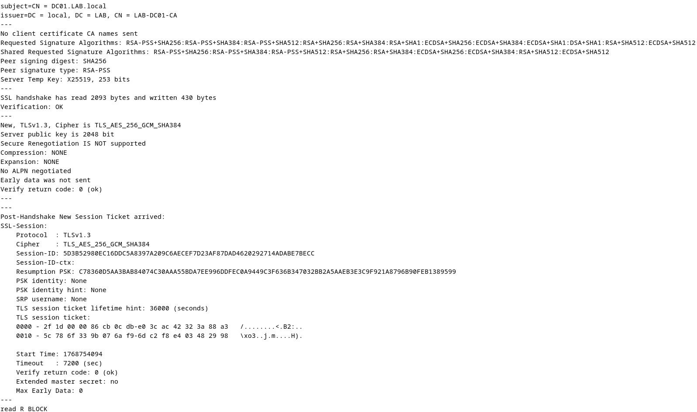

# Authentication & Directory Integration (LDAP / LDAPS)

## Purpose
This document describes how osTicket is integrated with Microsoft Active Directory using LDAP over SSL (LDAPS). The goal of this integration is to provide centralized authentication, consistent identity management, and secure credential handling aligned with enterprise IT standards.

This configuration allows both end users and support agents to authenticate using their Active Directory accounts while maintaining least-privilege access and encrypted directory communication.

## Authentication Overview
osTicket uses Active Directory as the authoritative identity source for authentication. Rather than maintaining local application accounts for users and agents, authentication requests are delegated to the domain controller over a secure LDAPS connection.

Key characteristics of the authentication model:
- Centralized identity management via Active Directory
- Encrypted LDAP communication using TLS
- Least-privilege service account for directory access
- No plaintext credential transmission

## Directory Environment

### Active Directory Details
- **Domain:** lab.local  
- **Domain Controller:** dc01.lab.local  
- **DC IP Address:** 192.168.56.103  
- **Directory Services:** AD DS, DNS  
- **Certificate Authority:** Internal Microsoft CA  

### osTicket Server
- **Hostname:** osticket01.lab.local  
- **Operating System:** Debian GNU/Linux 12  
- **Ticket Platform:** osTicket v1.18.x  

## Why LDAPS (Not Plain LDAP)
Plain LDAP transmits credentials in a form that can be intercepted if traffic is captured. In enterprise environments, this is considered unacceptable.

LDAPS provides:
- Encryption of authentication traffic
- Protection of user credentials in transit
- Server identity validation using certificates
- Compliance with common security baselines

This lab intentionally uses LDAPS to reflect real-world enterprise requirements and best practices.

## Certificate Trust Model

### Internal Certificate Authority
Active Directory uses certificates issued by an internal Microsoft Certificate Authority to secure LDAPS. For osTicket to trust the domain controller, the Debian server must trust this internal CA.

### Debian Trust Configuration
- The internal Microsoft CA certificate is installed in the Debian trusted certificate store
- System-wide trust allows all LDAP clients to validate the DC’s certificate
- TLS validation prevents man-in-the-middle attacks during authentication

This mirrors how Linux servers are commonly integrated into Windows enterprise environments.

## Service Account Design

### Service Account Details
- **Account:** svc_osticket@lab.local
- **Purpose:** Directory lookup and authentication support
- **Permissions:** Read-only directory access

### Least-Privilege Principles
The service account:
- Cannot modify directory objects
- Is not a domain administrator
- Is used only for LDAP bind and search operations

User credential verification is performed against Active Directory, not stored within osTicket.

## osTicket LDAP Configuration

### Connection Settings
- **LDAP URI:** ldaps://dc01.lab.local:636
- **Bind DN:** svc_osticket@lab.local
- **Base DN:** DC=lab,DC=local

### Authentication Behavior
- Users authenticate using AD credentials
- User records are created automatically in osTicket upon first login
- Agents authenticate using AD accounts assigned to appropriate osTicket roles

### Attribute Mapping
Common directory attributes used include:
- `sAMAccountName`
- `mail`
- `displayName`
- `memberOf`

## Authentication Flow

### User Login Flow
1. User accesses the osTicket web portal
2. Credentials are submitted to osTicket
3. osTicket binds to Active Directory over LDAPS
4. Credentials are validated by the domain controller
5. User is granted access and mapped to an osTicket user profile

### Agent Login Flow
1. Agent accesses the osTicket agent portal
2. Authentication occurs via AD over LDAPS
3. Role and department permissions are applied within osTicket
4. Access is granted based on RBAC configuration

## Security Considerations
- All LDAP traffic is encrypted using TLS
- Service account credentials are stored securely within osTicket
- Certificate validation prevents rogue directory impersonation
- Authentication failures are logged for troubleshooting

## Validation & Testing

The LDAPS integration was validated by:
- Successful user logins using Active Directory credentials
- Successful agent authentication with enforced role permissions
- Verification of LDAPS connectivity from Debian to the domain controller
- Confirmation of trusted certificate chain on the osTicket server

## Supporting Screenshots

The following screenshots demonstrate secure LDAPS integration and successful Active Directory authentication:

- LDAPS connectivity validation from Debian

- Internal CA trust configuration

- Successful AD-authenticated user and agent logins

## Common Failure Scenarios

| Issue | Likely Cause |
|------|-------------|
| LDAPS connection fails | Certificate trust not established |
| Authentication timeout | Firewall or network connectivity issue |
| Invalid credentials | Incorrect bind DN or service account password |
| Login works intermittently | DNS resolution or certificate mismatch |

## Future Enhancements
- Map Active Directory groups directly to osTicket roles
- Enforce MFA at the directory level
- Implement account lockout alerting for failed login attempts
- Audit and alert on authentication anomalies
