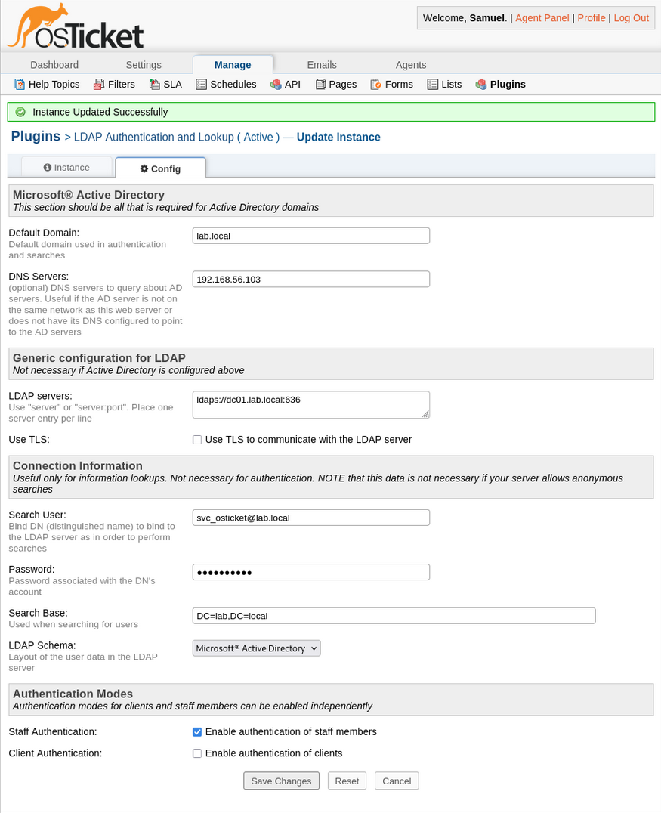
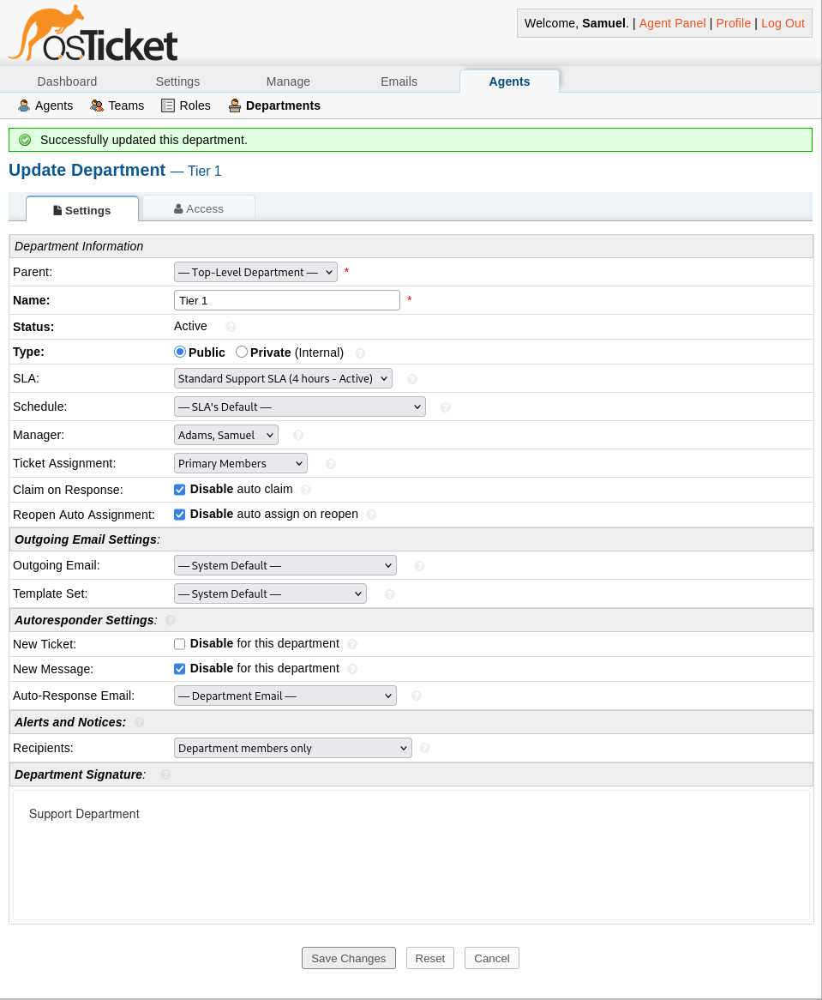

# Security Hardening and Risk Controls

## Purpose

This document outlines the security controls implemented to harden the internal IT helpdesk environment.  
The goal is not absolute security, but **risk reduction appropriate to an internal enterprise helpdesk** backed by centralized identity.

This environment prioritizes:
- Identity-driven access control
- Least privilege
- Auditability
- Reduction of attack surface

## Threat Model

This lab simulates an **internal-only corporate helpdesk**. The following assumptions guide security decisions:

- The helpdesk is not internet-facing
- All users and agents authenticate via Active Directory
- Compromise of a workstation is plausible
- Compromise of the Domain Controller is out of scope (but considered in failure scenarios)
- The helpdesk server must not become a lateral movement pivot

## Authentication Hardening

### LDAP over SSL (LDAPS)

- All directory authentication uses **LDAPS (TCP 636)**
- Plain LDAP binds are disabled
- Certificate trust is explicitly configured on the osTicket server
- Authentication failures are logged at both the application and directory level

**Rationale:**  
Credentials must never traverse the network in cleartext, even on internal segments.

### Service Account Controls

- A dedicated Active Directory service account is used for LDAP binding
- Account permissions are limited to:
  - Directory read
  - User and group lookup
- Interactive logon is denied
- Account is excluded from privileged groups

**Rationale:**  
Service accounts represent a high-value target. Limiting scope reduces blast radius.

## osTicket Application Hardening

### Authentication Policy

- Local osTicket staff authentication is disabled
- All staff authentication is enforced via Active Directory
- Client (end-user) authentication is disabled
- No fallback local administrator accounts exist

**Rationale:**  
Identity must be centralized. Bypassing AD bypasses audit and policy enforcement.

### Role-Based Access Control (RBAC)

- All agent permissions are role-based
- Roles are mapped to Active Directory security groups
- Permissions are explicitly denied unless required

Examples:
- Tier 1 agents cannot close tickets
- Tier 1 agents cannot modify SLAs
- Escalation authority is restricted to Tier 2 and above

**Rationale:**  
Reducing privilege reduces error impact and insider risk.

## Network and Host-Level Hardening

### Network Exposure

- Helpdesk server resides on an internal-only host network
- No inbound access from external networks
- Only required ports are exposed:
  - HTTPS (internal)
  - LDAPS
  - Database (local only)

### Host Controls

- Firewall rules explicitly restrict inbound traffic
- SSH access is limited to administrative users
- Root login via SSH is disabled
- Package updates are managed regularly

**Rationale:**  
The helpdesk server should not be usable as a pivot point during an intrusion.

## Logging and Auditability

### Application Logging

- osTicket ticket activity is logged:
  - Assignment changes
  - Status changes
  - Agent responses
- Authentication attempts are logged

### Infrastructure Logging

- Apache access and error logs enabled
- LDAP authentication events logged on the Domain Controller
- Logs retained for troubleshooting and audit review

**Rationale:**  
Security incidents are investigated after they happen. Logging enables accountability.

## Explicit Non-Implemented Controls

The following controls were intentionally not implemented at this stage:

- Multi-factor authentication (MFA)
- Public HTTPS exposure
- Email-based ticket ingestion
- Self-service client portal

**Rationale:**  
These controls introduce additional complexity and risk not aligned with the internal-only scope of this lab. They are considered future enhancements.

## Summary

Security in this environment is enforced primarily through:
- Centralized identity
- Encrypted authentication
- Role separation
- Reduced network exposure
- Comprehensive logging

This reflects a realistic internal enterprise helpdesk threat posture rather than a consumer-facing service model.
