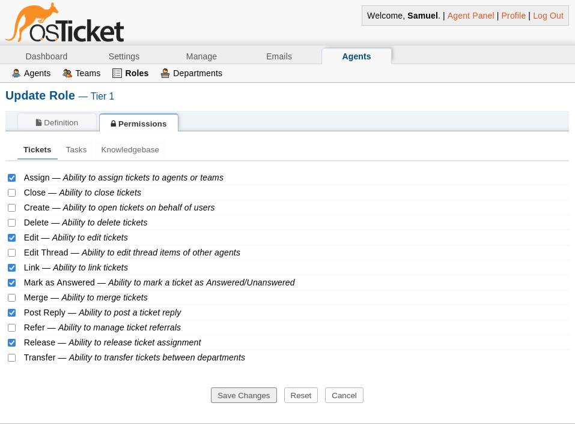
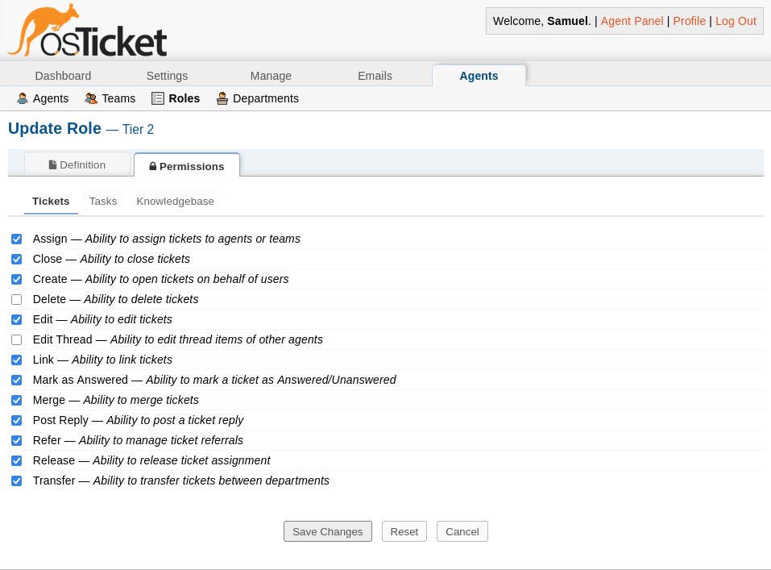

# Role-Based Access Control (RBAC) and Separation of Duties

## Purpose

This document describes how **role-based access control (RBAC)** is implemented within the internal IT helpdesk environment to enforce least privilege, separation of duties, and controlled escalation.

Rather than relying on individual accounts or discretionary permissions, access is governed by:
- Centralized identity (Active Directory)
- Security group membership
- Explicit role definitions within osTicket

This approach mirrors how enterprise helpdesks manage authority, accountability, and risk.

## RBAC Design Principles

The RBAC model in this environment is built on the following principles:

- **Least Privilege**  
  Agents receive only the permissions required to perform their assigned function.

- **Separation of Duties**  
  No single tier has full control over the ticket lifecycle.

- **Identity as the Control Plane**  
  Access is derived from Active Directory group membership, not local application accounts.

- **Explicit Escalation Paths**  
  Higher authority is granted only through tier escalation, not convenience.

## Active Directory Security Groups

All helpdesk access begins in Active Directory. No standalone osTicket staff accounts are used.

### Core Groups

- **IT_Tier1**
  - First-line support
  - Intake, triage, and initial troubleshooting

- **IT_Tier2**
  - Advanced troubleshooting
  - Escalation handling
  - Resolution authority

- **IT_NOC**
  - Infrastructure and service monitoring
  - Incident response
  - No direct user interaction

- **IT_ServiceAccounts**
  - Non-interactive service identities
  - LDAP bind and application integration

### Rationale

Using AD security groups allows:
- Centralized access revocation
- Auditable role changes
- Consistent identity enforcement across systems

Removing a user from a group immediately removes their operational authority.

## osTicket Role Definitions

Roles within osTicket define **what an authenticated agent is allowed to do** once access is granted.

Roles are mapped to Active Directory groups to ensure identity-driven authorization.

### Tier 1 Role

**Intended Function:**  
Initial ticket intake, user communication, and basic troubleshooting.

**Allowed Actions**
- View assigned tickets
- Respond to users
- Add internal notes
- Assign tickets within Tier 1

**Explicitly Restricted**
- Closing tickets
- Modifying SLAs
- Escalating directly to NOC
- Administrative configuration changes

**Security Rationale:**  
Tier 1 agents handle volume, not authority. Restricting closure and escalation prevents premature resolution and enforces review.

### Tier 2 Role

**Intended Function:**  
Advanced troubleshooting and escalation handling.

**Allowed Actions**
- All Tier 1 actions
- Close tickets with documented resolution
- Modify ticket priority and SLA
- Escalate tickets to NOC
- Reassign tickets across departments

**Restrictions**
- No system-wide administrative access
- No authentication or role configuration changes

**Security Rationale:**  
Tier 2 serves as the decision boundary between user-facing support and infrastructure operations.

### NOC Role

**Intended Function:**  
Operational monitoring and incident response.

**Allowed Actions**
- View escalated or monitoring-generated tickets
- Update internal notes
- Change ticket status

**Explicitly Restricted**
- Responding directly to end users
- Creating or modifying user tickets
- Changing SLAs or priorities set by Tier 2

**Security Rationale:**  
NOC focuses on system stability, not customer communication. This separation prevents conflicting actions during incidents.

## Department-Level Enforcement

RBAC is reinforced at the department level to prevent cross-tier privilege bleed.

Examples:
- Tier 1 department restricts ticket assignment to primary members
- Auto-claim and auto-reassign on reopen are disabled
- Alerts are limited to department members only

This ensures that:
- Authority is not gained accidentally
- Escalation is deliberate
- Reopened tickets trigger review, not repetition

## Identity Lifecycle Management

Access changes follow standard identity lifecycle practices:

- **Onboarding**
  - User added to appropriate AD group
  - osTicket access granted automatically via LDAP

- **Role Change**
  - Group membership updated
  - Permissions adjusted without manual application changes

- **Offboarding**
  - User removed from AD groups
  - osTicket access revoked immediately

No local cleanup inside osTicket is required.

## Risk Reduction Outcomes

This RBAC implementation reduces risk by:
- Limiting blast radius of compromised accounts
- Preventing unauthorized ticket closure or escalation
- Ensuring accountability through tiered authority
- Enforcing consistent access control across systems

## Summary

Role-based access control in this environment is not an afterthought.  
It is a foundational control that governs how work is performed, reviewed, and escalated.

By tying authorization to centralized identity and clearly defined roles, the helpdesk operates with:
- Predictable authority boundaries
- Auditable access decisions
- Operational realism consistent with enterprise IT environments
