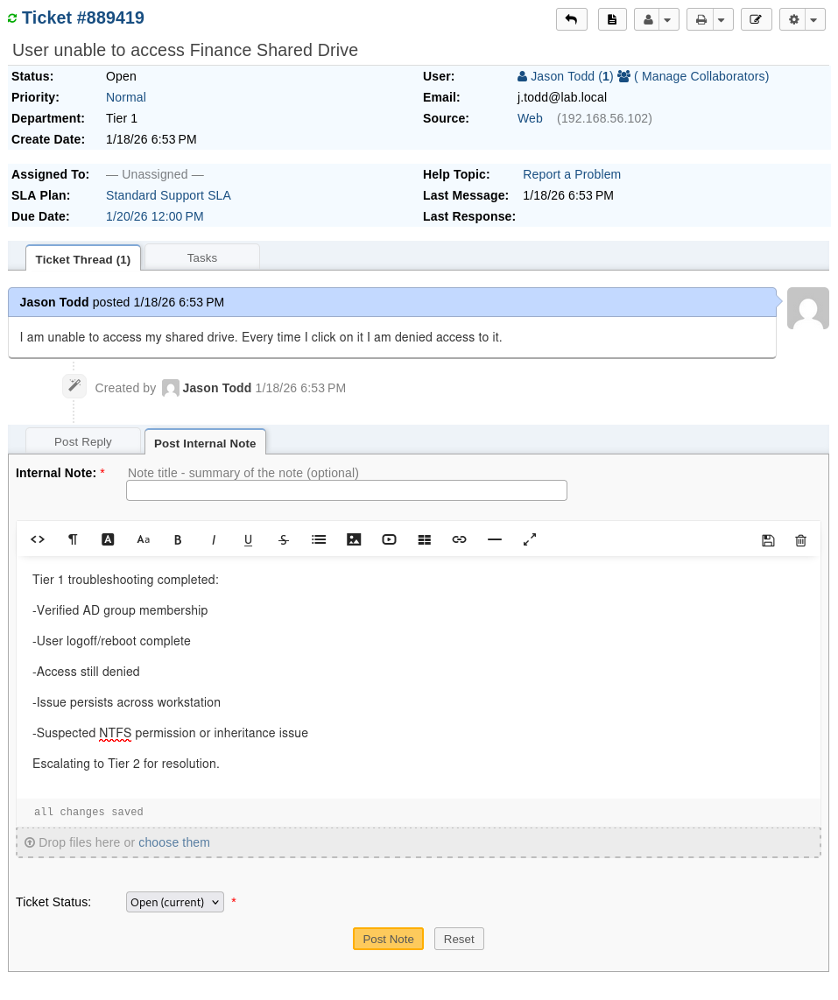
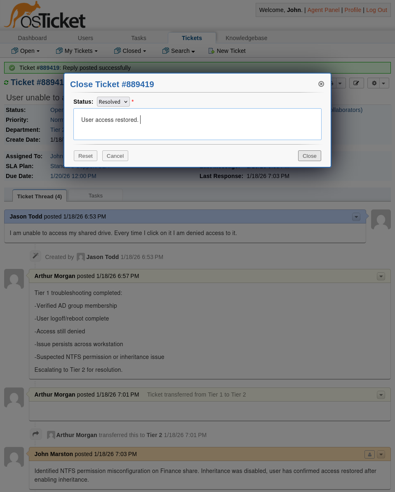

# Helpdesk Workflows and Ticket Lifecycle

## Purpose

This document describes the **operational workflows** used by the internal IT helpdesk.  
The goal is to demonstrate how incidents, requests, and escalations move through the system in a controlled, auditable manner.

These workflows are designed to:
- Enforce separation of duties
- Prevent premature resolution
- Ensure accountability across tiers
- Mirror real-world enterprise support operations

## Core Workflow Principles

All workflows in this environment follow these principles:

- **Single Intake Point**  
  All user-facing tickets enter through Tier 1.

- **Tiered Authority**  
  Troubleshooting depth and decision authority increase with escalation.

- **Deliberate Escalation**  
  Tickets move forward only when justified, not by convenience.

- **Documented Actions**  
  All troubleshooting, decisions, and handoffs are recorded in the ticket.

## Standard Incident Workflow (Tier 1 → Tier 2)

### 1. Ticket Creation

Tickets are created via:
- End-user submission from a workstation
- Manual creation by Tier 2 (on behalf of users)

All tickets are initially routed to the **Tier 1 department**.

### 2. Tier 1 Intake and Triage

**Tier 1 Responsibilities**
- Review ticket details
- Verify user identity and scope
- Categorize issue using help topics
- Perform basic troubleshooting
- Communicate with the user

**Allowed Outcomes**
- Issue resolved at Tier 1 (status updated, but not closed)
- Escalation required

Tier 1 agents **cannot close tickets** and **cannot escalate outside defined paths**.

### 3. Escalation to Tier 2

Escalation occurs when:
- The issue exceeds Tier 1 authority
- Additional access or changes are required
- Repeated failure indicates deeper root cause

**Escalation Requirements**
- Internal notes documenting:
  - Steps already taken
  - Observed behavior
  - Relevant screenshots or logs
- Ticket reassigned to Tier 2

This ensures Tier 2 receives context, not guesswork.

### 4. Tier 2 Resolution

**Tier 2 Responsibilities**
- Perform advanced troubleshooting
- Modify access, permissions, or configurations
- Coordinate with NOC if infrastructure impact is suspected
- Resolve or escalate further

**Tier 2 Authority**
- Close tickets
- Modify SLAs and priority
- Escalate to NOC

Resolution steps are documented before ticket closure.

## Access Request Workflow

### 1. Request Intake

Access requests (e.g., group membership, shared drive access) are submitted as tickets and routed to Tier 1.

### 2. Tier 1 Validation

Tier 1 verifies:
- Request clarity
- User identity
- Required approvals (if simulated)

Tier 1 does **not** grant access.

### 3. Tier 2 Fulfillment

Tier 2:
- Confirms authorization
- Implements access change
- Documents action taken
- Closes the ticket

This prevents privilege creep and unauthorized access changes.

## Reopened Ticket Workflow

Reopened tickets are treated as **signals**, not annoyances.

### Reopen Behavior
- Auto-reassignment is disabled
- Ticket returns to queue for review

### Review Actions
- Tier 1 reassesses scope
- Determines if escalation is required
- Adds internal notes explaining failure

Repeated reopens typically result in Tier 2 escalation.

## Incident Correlation Workflow

When multiple tickets report similar symptoms:

### Tier 1 Actions
- Link related tickets
- Add internal notes indicating potential incident

### Tier 2 Actions
- Identify common root cause
- Merge or associate tickets as appropriate
- Communicate status updates consistently

This workflow prevents duplicate effort and missed patterns.

## NOC Escalation Workflow

NOC involvement is limited and intentional.

### Escalation Triggers
- Infrastructure service impact
- Authentication failures
- Monitoring alerts
- SLA breach risk

### NOC Responsibilities
- Investigate service health
- Stabilize affected systems
- Update internal notes only

NOC does **not** communicate with users and does **not** close tickets.

## Ticket Closure Standards

Tickets may only be closed by Tier 2.

Before closure, tickets must include:
- Clear resolution summary
- Actions taken
- Confirmation (where applicable)

This ensures:
- Auditability
- Knowledge reuse
- Accountability

## Workflow Enforcement Mechanisms

Workflows are enforced through:
- Role-based access control
- Department assignment restrictions
- Disabled auto-claim and auto-reassignment
- SLA-driven escalation

Agents are guided by process, not trust alone.

## Summary

These workflows reflect a realistic enterprise helpdesk model where:
- Authority increases with responsibility
- Escalation is deliberate
- Mistakes are visible and recoverable
- Operations are repeatable and auditable

The result is a helpdesk environment that prioritizes reliability, accountability, and operational discipline over convenience.
