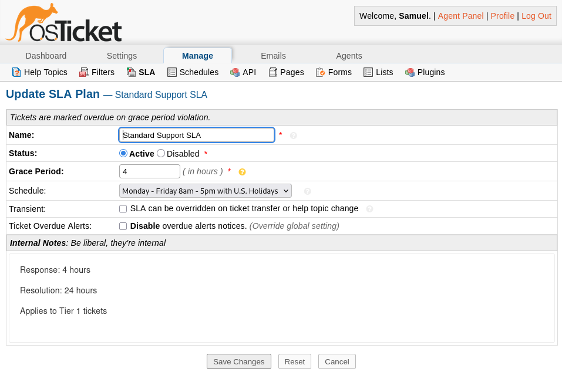

# SLA and Escalation Model

## Purpose

This lab implements a realistic **SLA-driven escalation model** designed to mirror how internal enterprise IT helpdesks actually operate.

The goal is not just to resolve tickets, but to:
- Enforce accountability
- Prioritize business impact
- Separate responsibilities between support tiers
- Demonstrate operational maturity



SLAs are treated as **management controls**, not cosmetic timers.

## Support Tier Model

The helpdesk is structured into clearly defined operational tiers:

### Tier 1 – Service Desk
**Responsibilities**
- First point of contact
- Password resets
- Account lockouts
- Basic access issues
- Known-issue resolution using documented procedures

**Constraints**
- Limited permissions
- No direct system-level changes. Cannot modify GPOs, servers, or core services
- Escalates when scope or risk exceeds Tier 1 authority

### Tier 2 – Systems & Identity Support
**Responsibilities**
- Active Directory troubleshooting
- Group membership corrections
- Permission and access remediation
- Application-level issues
- Root cause analysis for recurring incidents

**Constraints**
- Changes must be auditable
- Escalation required for infrastructure-wide impact or service outages

### NOC (Simulated / Future Expansion)
**Responsibilities**
- Infrastructure availability
- Monitoring alerts
- Service outages
- Performance degradation
- Incident correlation across systems


## SLA Design Philosophy

SLAs are designed based on **impact and urgency**, not arbitrary time limits.

Key principles:
- Business impact determines response priority
- Higher tiers receive tighter resolution targets
- SLA violations trigger escalation, not punishment

## SLA Definitions

| SLA Name                | Response Time | Resolution Time | Applied To                          |
|-------------------------|---------------|------------------|--------------------------------------|
| Low Priority Request    | 8 business hrs | 3 business days  | Non-urgent access requests           |
| Standard Incident       | 4 business hrs | 1 business day   | User-facing issues                   |
| High Priority Incident  | 1 business hr  | 4 business hrs   | Business-impacting issues            |
| Critical Incident       | 15 minutes     | 1 business hr    | Service outages / auth failures      |

SLAs are assigned automatically using help topics and ticket attributes.

## Escalation Logic

### Automatic Escalation Triggers
A ticket is escalated when:
- SLA response or resolution threshold is breached
- Issue category exceeds Tier 1 permissions
- Incident impacts multiple users or systems

### Escalation Flow

```text
User Issue
   ↓
Tier 1 Assignment
   ↓
Resolved? ── Yes → Closed
   ↓ No
Escalate to Tier 2
   ↓
Root Cause Identified?
   ↓
Yes → Resolution & Documentation
   ↓
No → Flag for NOC / Infrastructure Review
