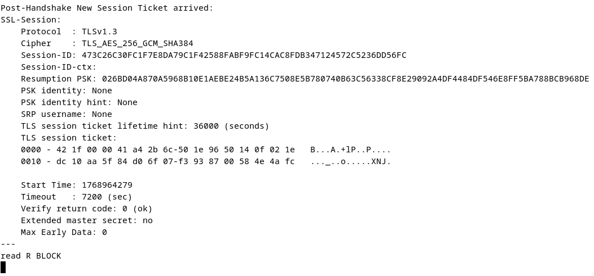
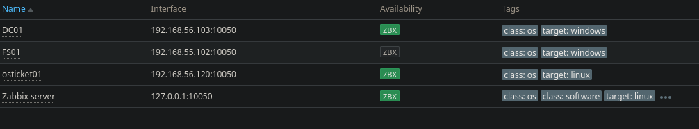

# Operations and Maintenance

## Purpose

This document describes how the helpdesk environment is **operated, maintained, and sustained over time**.  
The focus is not initial deployment, but **ongoing reliability, security, and recoverability**.

In enterprise environments, systems are evaluated by how they behave:
- After maintenance
- During failures
- Under change
- Over time

This lab intentionally incorporates operational practices to demonstrate long-term ownership rather than one-time setup.

## Operational Scope

This environment is treated as a **persistent internal service**, not a disposable test system.

Operational responsibility includes:
- Identity services (Active Directory)
- Authentication mechanisms (LDAP / LDAPS)
- Ticketing platform (osTicket)
- Database integrity and retention
- Workflow enforcement and auditability
- Service availability and recovery

All systems are assumed to be in continuous use.

## Operating System Maintenance

### Linux — osTicket Server (Debian)

Operational practices include:
- Regular security and package updates
- Verification of Apache, PHP, and MariaDB services after patching
- Intentional reboot scheduling to avoid unexpected downtime
- Log review following updates to detect regressions

The osTicket server is treated as a production system where availability and stability matter.

**Post-maintenance service validation:**

### Windows Server — Domain Controller

Operational practices include:
- Scheduled Patch Tuesday updates
- Coordinated reboots to avoid authentication outages
- Post-update validation of:
  - Active Directory Domain Services
  - DNS
  - LDAPS functionality
- Review of system and security event logs after changes

Authentication services are treated as **critical infrastructure**, not background services.

## Application Maintenance (osTicket)

### Upgrade Discipline

osTicket updates are handled deliberately:
- Release notes reviewed prior to upgrade
- Configuration and database backups taken beforehand
- Plugin compatibility verified
- Post-upgrade functional validation performed

Blind updates are avoided to prevent workflow disruption or data loss.

### Configuration Drift Awareness

Key configuration areas are monitored for unintended change:
- LDAP authentication settings
- Department and role mappings
- SLA definitions
- Help topics and escalation rules

Changes are documented to preserve operational intent and auditability.

## Identity and Access Maintenance

### Active Directory Hygiene

Ongoing directory maintenance includes:
- Review of disabled or stale accounts
- Group membership audits
- Service account monitoring
- Enforcement of least-privilege access

Identity hygiene is treated as a preventive control, not a cleanup task.

### LDAP / LDAPS Health Validation

Authentication health is actively validated, not assumed.

Validation practices include:
- Periodic LDAPS connectivity testing
- Certificate trust verification
- Review of authentication failures
- Detection of anomalous login behavior

Authentication failures are treated as **priority incidents**, not background noise.

**LDAPS post-maintenance validation from osTicket server:**

This confirms encrypted authentication, certificate trust integrity, and successful session establishment.

## Database Operations

### MariaDB Responsibilities

The database is treated as operational data storage, not disposable logs.

Operational tasks include:
- Regular logical backups
- Disk space monitoring
- Integrity checks
- Review of database service logs

Ticket history and audit trails are preserved intentionally.

## Backup and Recovery Strategy

### Protected Data

Backups include:
- osTicket database
- Application configuration files
- LDAP integration settings
- Knowledge base content

### Recovery Philosophy

Backups are only considered successful if recovery is possible.  
The focus is on **restoration capability**, not backup existence.

## Monitoring and Service Visibility

### Centralized Monitoring (Zabbix)

The environment integrates centralized monitoring to provide continuous operational visibility.

Monitored systems include:
- Active Directory Domain Controller
- File Server
- osTicket application server
- Zabbix monitoring server

Monitoring provides:
- Service availability checks
- Authentication infrastructure visibility
- Resource utilization awareness
- Early detection of operational risk

**Centralized monitoring overview:**

Monitoring is treated as an operational multiplier, not an afterthought.

## Incident Handling During Operations

Operational incidents follow established workflows:

1. Issue detected (user report or monitoring alert)
2. Ticket created or flagged
3. SLA applied
4. Tier 1 validates symptoms
5. Tier 2 performs remediation
6. Root cause documented
7. Knowledge base updated where applicable

Operational incidents feed directly into process improvement.

## Change Management Discipline

All non-trivial changes follow a structured process:
- Define change scope
- Assess operational impact
- Apply change during an appropriate window
- Validate functionality
- Document outcome

Uncontrolled changes are treated as technical debt.

## Documentation as an Operational Asset

Documentation is treated as part of the operational system.

Maintained documentation includes:
- Architecture and trust boundaries
- Workflow and escalation logic
- Known issues and resolutions
- Authentication dependencies

This ensures continuity and recoverability even in a single-admin environment.

## Failure Scenarios Considered

This lab explicitly plans for realistic failure scenarios:
- Domain Controller downtime
- LDAPS authentication failure
- Database corruption or disk exhaustion
- Certificate expiration
- Configuration drift after updates

Planning for failure is considered a baseline operational skill.

## Why This Matters

Operations and maintenance separate:
- Deployments from systems
- Labs from environments
- Setup knowledge from ownership

This section demonstrates the ability to **keep systems running**, recover them when they fail, and maintain trust over time.

## Future Operational Enhancements

Planned improvements include:
- Automated backup scheduling
- Monitoring-driven ticket creation
- NOC alert workflows
- Scheduled maintenance records
- Post-incident review templates

## Summary

This helpdesk environment is treated as a living system.

It is:
- Maintained deliberately
- Secured intentionally
- Observed continuously
- Designed to fail safely and recover cleanly

Operations and maintenance are not optional.  
They are the proof that this environment reflects real enterprise IT.
