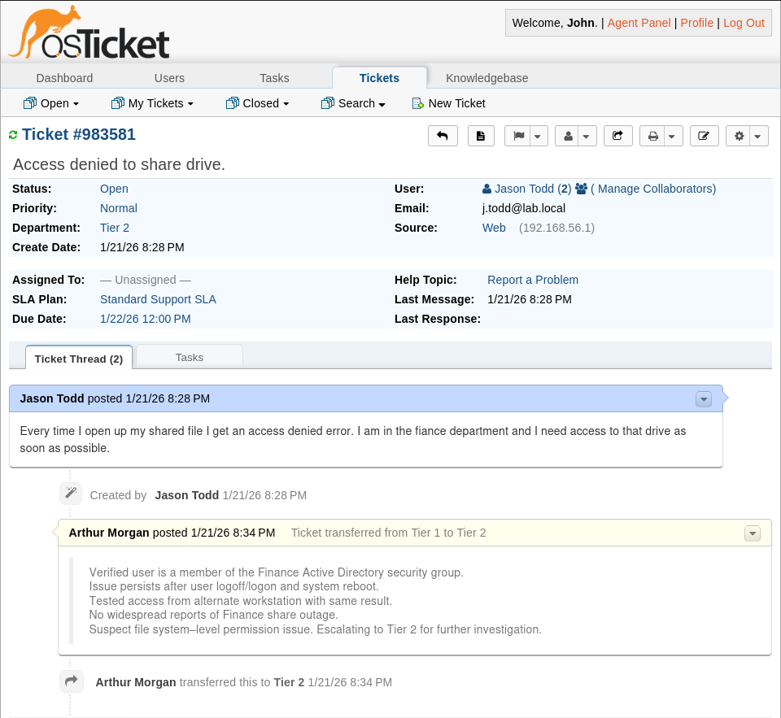

# Troubleshooting and Incident Resolution

## Purpose

This document demonstrates **real-world troubleshooting, escalation judgment, and root cause analysis** within the helpdesk environment.

The objective is not to imply that failures are rare.  
The objective is to show that failures are handled with:

- Structured diagnosis  
- Tier-appropriate authority  
- Clear escalation justification  
- Verifiable root cause analysis  
- Auditable documentation  

In enterprise IT, troubleshooting discipline matters more than initial setup.

## Troubleshooting Methodology

All incidents follow a consistent diagnostic framework:

1. Identify reported symptoms  
2. Confirm scope and business impact  
3. Eliminate likely failure domains  
4. Escalate when authority or access limits are reached  
5. Apply corrective action  
6. Verify resolution  
7. Document findings for reuse  

Guessing is avoided.  
Changes are deliberate.  
Fixes are repeatable.

## Failure Domains

Incidents are categorized by **system dependency**, not surface symptoms.

### Identity & Access
- Active Directory group membership
- Authentication vs authorization failures
- Directory dependency validation

### Application (osTicket)
- Role enforcement
- Workflow routing
- SLA application

### Infrastructure
- File server permissions
- NTFS inheritance behavior
- Service availability

## Primary Incident Case Study  
### User Unable to Access Finance Shared Drive

This incident is used as a full escalation example because it spans **multiple systems**, requires **tier separation**, and reflects a common enterprise failure mode.

## Incident Summary

**User Reported Issue**  
User reports receiving an “Access Denied” error when attempting to access the Finance shared drive. User states they are part of the Finance department and previously had access.

**Impact**
- Single user blocked from Finance resources  
- Business impact limited to role-specific tasks  

## Tier 1 — Initial Diagnosis and Scope Validation

Tier 1 responsibility is to **verify symptoms, confirm scope, and rule out common causes** without making system-level changes.

Actions performed by Tier 1:
- Verified user membership in Finance Active Directory security group  
- Confirmed issue persists after logoff/logon and system reboot  
- Tested access from alternate workstation  
- Confirmed no widespread Finance share outage  

Based on findings, Tier 1 identified the issue as **authorization-related**, not authentication or endpoint-related.

### Tier 1 Diagnostic Evidence

**Escalation Justification**
- Correct AD group membership confirmed  
- Issue reproducible across systems  
- Indicates file system–level permission issue  
- Escalation required due to Tier 1 authority limits  

This escalation demonstrates deliberate troubleshooting rather than premature handoff.

## Tier 2 — Root Cause Analysis and Remediation

Tier 2 assumed responsibility due to the need for **server-level inspection and permission changes**.

Actions performed by Tier 2:
- Reviewed Tier 1 diagnostic notes  
- Confirmed group membership and reproduced issue  
- Inspected NTFS permissions on Finance share hosted on `FS01`  

### Tier 2 Root Cause Evidence

**Root Cause Identified**
- NTFS inheritance was disabled on the Finance directory  
- Finance group permissions were not propagating to child objects  
- Access denied despite correct Active Directory group membership  

This distinction highlights the difference between **identity correctness** and **authorization enforcement**.

## Resolution and Verification

**Corrective Action**
- Restored NTFS inheritance on Finance share  
- Verified effective permissions  
- Confirmed access restored with user  

**Outcome**
- User access restored successfully  
- No broader infrastructure impact  
- Incident fully documented  

Resolution included both remediation and verification before closure.

## Escalation Decision Matrix

| Indicator                      | Tier 1 | Tier 2 | NOC |
|--------------------------------|--------|--------|-----|
| Single-user issue              | ✓      |        |     |
| Authorization failure          |        | ✓      |     |
| Multi-user impact              |        | ✓      |     |
| Infrastructure outage          |        |        | ✓   |
| SLA breach risk                |        | ✓      |     |

Escalation is driven by **impact and authority**, not convenience.

## Evidence Collection and Documentation

Throughout troubleshooting:
- Internal ticket notes captured diagnostic reasoning  
- Assumptions were validated before escalation  
- Root cause was documented clearly  
- Resolution steps were preserved for audit and reuse  

Evidence is treated as part of the fix, not an afterthought.

## Post-Incident Actions

After resolution:
- Escalation criteria refined for Tier 1  
- Documentation updated to reflect NTFS inheritance risks  
- Incident retained as a reference case  

Troubleshooting outcomes feed directly into **operational improvement**.

## Why This Matters

Many environments can deploy systems.  
Fewer can diagnose layered failures involving:

- Active Directory  
- File system permissions  
- Authorization boundaries  
- Tiered responsibility  

This incident demonstrates **operational maturity**, not just technical familiarity.

## Summary

Failures are expected.  
Poor diagnosis is optional.

This lab demonstrates the ability to:
- Detect issues accurately  
- Escalate responsibly  
- Resolve safely  
- Document for future reuse  

Troubleshooting is not a weakness.  
It is proof that the environment is real.
